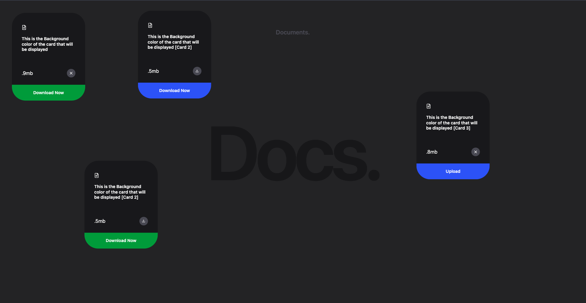

# My React Project

Welcome to My React Project! This project is designed to showcase a dynamic and responsive user interface with various background color cases for cards. Below, you'll find instructions on how to clone and run this project locally.


## Screenshots

Here are some screenshots of the project:



## Getting Started

To get a local copy up and running, follow these simple steps.

### Prerequisites

Before you begin, ensure you have the following installed:

- Node.js
- npm (Node Package Manager)

### Installation

1. **Clone the repository**

   ```bash
   git clone https://github.com/sudo-om/Docs.git

2. **Navigate to the project directory**

   ```bash
   cd Docs

3. **Install dependencies**
    
    ```bash
    npm install
4  **Run the development Server**

    ```bash
    npm start
  